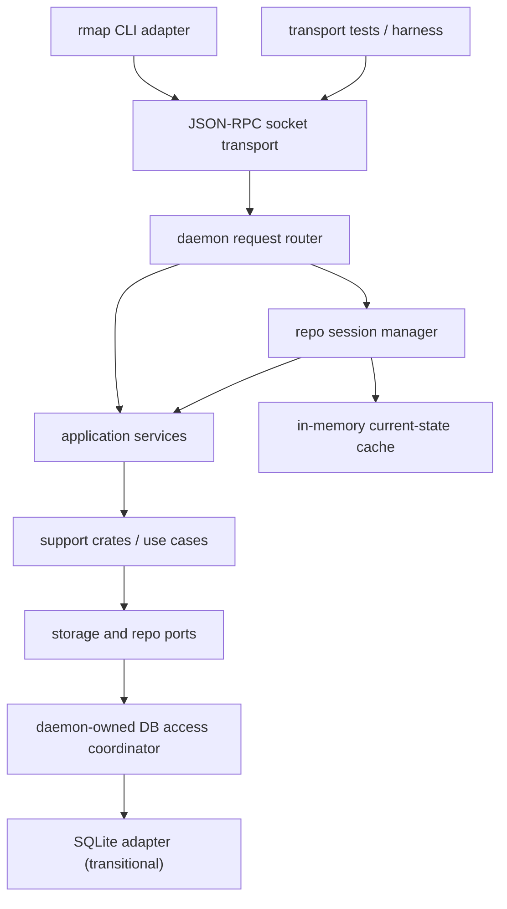

# rmap Daemon Architecture

Status: DESIGN PHASE
Created: 2026-04-30
Maturity target: PROTOTYPE -> MATURE

## 1. Problem Statement

`rmap` is moving toward a long-lived daemon because repeated one-shot CLI execution is the wrong runtime shape for the product vision.

Current one-shot execution repeats volatile outer-layer work on every command:
- process startup
- CLI argument parsing
- SQLite open + migration checks
- extractor and parser initialization
- repeated loading of facts that are stable across adjacent queries
- repeated recomputation of query context that a long-lived process could retain

This is operationally expensive, but the deeper issue is architectural.
A daemon must NOT be implemented as "CLI logic behind a socket". If that happens,
command handlers become the real application layer and every new transport re-embeds
CLI-specific behavior.

There is also a concurrency requirement that is not optional:
- multiple AI agents must be able to query and refresh the same repo state
- reads will be much more frequent than writes
- agents must not stomp over each other at the SQLite boundary
- the daemon must become the synchronization authority for shared repo-graph databases

If clients continue opening the same `.db` file independently for mixed read/write
traffic, the daemon has failed its primary operational purpose.

The recent `main.rs` refactor materially improved this situation. Command-family
modules now expose where the real seams are and where CLI-local orchestration still
needs to be extracted.

## 2. Architectural Position

The daemon is an **outer adapter**, not the product center.

The product center remains:
- support modules with deterministic domain logic
- transport-neutral application services
- explicit request/response DTOs
- typed errors

The daemon is only a delivery mechanism for these services.

This aligns with existing project rules:
- dependency rule: inward only
- support module first
- storage is adapter
- deterministic output
- explicit degradation (`null` = unknown, empty = known-zero)

It also aligns with `docs/VISION.md`:
- primary truth: current repo state in memory
- secondary truth: persistent disk cache
- git owns history
- repo-graph owns current-state structured truth

It must also align with the product's real core business logic:
- model relationships in legacy code that determine how change can be made safely
- keep those relationship models language-neutral
- let extractors for C, C++, Rust, Python, Java, TypeScript, and later Go/Scala/Kotlin
  feed the same relationship substrate instead of creating language-specific product silos

## 3. Non-Goals

This daemon design explicitly does **not** do the following:

- wrap existing CLI handlers and call that architecture complete
- make HTTP the product center
- turn retained snapshots into a historical warehouse
- move domain logic into transport routing or socket handlers
- conflate daemon-local caches with canonical truth
- invent daemon-only semantics for `orient`, `check`, `explain`, `modules`, `policy`, or other surfaces
- permit daemon-backed clients to keep mutating the same SQLite file out-of-band

## 4. Core Business Logic Center

The daemon should revolve around the stable relationship model, not around command names
and not around extractor implementation details.

The most valuable long-lived substrate is the language-neutral model of legacy-code
change relationships, especially those motivated by *Working Effectively with Legacy Code*:
- boundaries
- seams
- enabling points
- sensing surfaces
- separation barriers
- effect paths
- return-fate and status-mapping policy flow
- state/resource touchpoints
- module dependency pressure
- testability constraints

Extractors are evidence adapters for these relationships.
The daemon's job is to serve this relationship substrate safely to many agents at once.

## 5. What the `main.rs` Refactor Already Bought

The refactor changed the composition shape of the outermost Rust layer.

Before:
- `rust/crates/rgr/src/main.rs` mixed dispatch, parsing, orchestration, and output shaping
- command behavior was hard to separate from process entry behavior
- a daemon path would likely have duplicated command behavior behind another outer surface

Now:
- command families live under `rust/crates/rgr/src/commands/`
- shared CLI concerns live under `rust/crates/rgr/src/cli/`
- some reusable orchestration is already moving into support crates such as:
  - `rust/crates/agent/`
  - `rust/crates/module-queries/`
  - `rust/crates/policy-facts/`
  - `rust/crates/trust/`
  - `rust/crates/gate/`
  - `rust/crates/repo-index/`

This is not daemonization, but it is enabling work. It exposed which command families
are already thin adapters and which ones still hide application orchestration.

## 6. Current-State Read of the Rust Architecture

### Already daemon-friendly

These areas already resemble transport-neutral use cases or support modules:
- `rust/crates/agent/` for `orient`, `check`, `explain`
- `rust/crates/gate/` for gate assembly
- `rust/crates/trust/` for trust evaluation
- `rust/crates/module-queries/` for preloaded module fact orchestration
- `rust/crates/policy-facts/` for deterministic policy extraction
- `rust/crates/repo-index/` for indexing/refresh orchestration

### Still too CLI-shaped

Several command families still mix application orchestration with CLI-local concerns:
- graph query surfaces
- module discovery surfaces
- resource/state-boundary surfaces
- governance write flows under `declare`
- some output DTO assembly performed directly in command modules

### Main gap

The missing layer is an explicit **application service layer** between:
- support modules / storage ports
- transport adapters (CLI now, daemon next)

Without that layer, a daemon would still pull logic from command modules and would
remain CLI-shaped internally.

## 7. Required Layering

The daemon-ready architecture needs four layers.

### 7.1 Support modules

Purpose:
- deterministic logic
- no transport knowledge
- no socket/session concerns
- no CLI rendering concerns

Examples:
- `agent`
- `gate`
- `trust`
- `module-queries`
- `policy-facts`
- `repo-index`
- extractor crates
- classifier crates

### 7.2 Application services

Purpose:
- orchestrate one use case
- depend only on support modules and ports
- define request/response DTOs
- define typed errors
- remain callable from CLI, daemon, tests, and future batch workers

Representative service families:
- `IndexRepo`
- `RefreshRepo`
- `QueryCallers`
- `QueryCallees`
- `QueryImports`
- `FindPath`
- `ListModules`
- `ShowModule`
- `ListModuleFiles`
- `EvaluateModuleViolations`
- `ListSurfaces`
- `ShowSurface`
- `RunPolicyFactsQuery`
- `RunOrient`
- `RunCheck`
- `RunExplain`
- `DeclareBoundary`
- `DeclareRequirement`
- `DeclareWaiver`
- `DeactivateDeclaration`

### 7.3 Transport adapters

Initial outer adapters:
- CLI adapter (`rmap`)
- daemon socket adapter

Possible later adapters:
- background worker / batch adapter
- test harness adapter

### 7.4 Runtime/session management

Purpose:
- manage long-lived repo state
- own caches, locks, cancellation, refresh swaps, and lifecycle
- stay outside support logic

This runtime layer belongs to the daemon adapter boundary, not to core support modules.

## 8. Authored Knowledge Model: Documents First

This system already treats documentation as a first-class surface. That needs to become
stronger, not weaker.

High-level rule:
- if a human or agent discovers architectural knowledge outside automatic extraction,
  the canonical authored form should be a documentation item
- the daemon/database may index, inventory, anchor, and project that documentation
- the daemon/database should NOT become the only opaque store for human-authored
  architectural knowledge

Implications:
- rationale, migration notes, seam notes, ownership notes, replacement plans, and
  hand-discovered relationship explanations should prefer document paths plus anchors
  over opaque JSON blobs with no first-class reading surface
- derived tables remain useful for query acceleration and filtering, but they are
  projections of authored knowledge, not the authored knowledge itself
- governance/policy objects may still need structured storage for deterministic
  enforcement, but discovery-oriented authored knowledge should bias toward documents

This is especially important for multi-agent use. A document is inspectable,
reviewable, versioned by git, and understandable outside repo-graph. An opaque
DB row is not.

## 9. Proposed Daemon Shape

Interpretation:
- the CLI does not know storage details
- the daemon router does not contain domain logic
- application services call support modules
- the daemon session manager provides warmed state and lifecycle control
- the daemon-owned DB coordinator is the only write path in daemon-backed mode
- SQLite remains an adapter during the transition period

## 10. Daemon Runtime Components

### 10.1 Request router

Responsibilities:
- decode JSON-RPC requests
- validate envelope shape
- route to the correct application service
- attach transport-scoped values such as wall clock time, cancellation handle, and progress sink
- serialize typed success/error DTOs

Must not:
- execute business rules
- assemble graph facts directly
- read SQLite directly except through service-owned ports/adapters

### 10.2 Repo session manager

Responsibilities:
- maintain per-repo runtime state
- load or warm state on demand
- coordinate read/query access versus refresh/index work
- pin a consistent snapshot view for each request
- swap refreshed state atomically
- evict idle sessions when policy requires it

Proposed per-repo record:
- repo identity and root path
- DB path / cache path
- current READY snapshot UID
- session state
- warmed query context handles
- in-memory projections/caches
- lock state
- DB access policy and handle set
- active request count
- last access time

### 10.3 DB access coordinator

This component is mandatory for the multi-agent goal.

Responsibilities:
- own the database handles used by daemon-backed clients
- present readers-writer semantics above SQLite
- serialize write-intent operations per repo
- keep read-heavy traffic from blocking each other unnecessarily
- prevent out-of-process agent commands from competing as ad hoc writers

Recommended initial shape:
- one writer connection per repo session
- one or more read-only/read-mostly connections for query traffic
- daemon-managed write queue per repo
- explicit publish points for refresh/index operations

Product rule:
- in daemon-backed mode, agents talk to the daemon
- they do not open the SQLite file directly for normal operations

SQLite already gives file-level locking and WAL behavior, but that is not the product
concurrency model. The product model is daemon-mediated coordination with explicit
readers-writer rules.

### 10.4 Progress broker

Responsibilities:
- receive structured progress events from long-running operations
- stream them to the requesting client
- preserve deterministic event ordering per request

Initial scope:
- index
- refresh
- docs extract
- other long-running extraction or recomputation tasks

### 10.5 Cancellation registry

Responsibilities:
- map request IDs to cancellation tokens
- allow client disconnect or explicit cancel to stop long-running work
- ensure cancelled work does not partially publish new session state

### 10.6 Maintenance lane

Responsibilities:
- session eviction
- stale cache cleanup
- warm-start metadata cleanup
- future `rmap clean` support

## 11. Repo Session State Model

A daemon needs explicit lifecycle states. Without them, refresh/query behavior becomes implicit and fragile.

Proposed states:
- `UNLOADED` — known repo, no active in-memory session
- `LOADING` — warming session from storage/disk cache
- `READY` — current state queryable
- `REFRESHING` — recomputing next state while current READY state remains queryable
- `FAILED` — last load/refresh failed; prior READY state may or may not exist
- `EVICTED` — state intentionally discarded

State rules:
- read queries never observe a half-built refresh
- refresh builds a candidate state off to the side
- publish is atomic: candidate replaces current READY only after successful completion
- failed refresh does not poison the previously published READY state
- cancellation during refresh discards the candidate state

## 12. Concurrency Model

The roadmap already points to three daemon lanes:
- query
- index
- maintenance

That direction is correct.

But it needs one more explicit statement:

**The daemon is the multi-agent arbitration layer for a repo database.**

If ten agents issue reads and one agent issues a refresh, the daemon decides how
that interaction proceeds. The agents do not coordinate by racing raw SQLite access.

### Query lane

Characteristics:
- many concurrent requests allowed
- operates on pinned READY state
- no mutation of published repo state
- should use daemon-owned read handles, not the writer handle when avoidable

### Index lane

Characteristics:
- at most one write/refresh operation per repo
- builds candidate state without invalidating active readers
- publishes by atomic swap
- owns all repo-mutating DB traffic in daemon-backed mode

### Maintenance lane

Characteristics:
- low priority
- never blocks correctness-critical reads unless explicitly required

### Locking rules

Per repo:
- one writer max
- multiple readers
- readers pin a snapshot/session generation
- published generation changes only on successful swap
- write requests queue behind the repo writer
- document/index refresh publish only at explicit swap boundaries

Cross repo:
- no global repo write lock unless a shared global resource truly requires it
- unrelated repos must not serialize each other

Practical consequence:
- many AI agents can read concurrently
- one AI agent can refresh or author a policy/document projection at a time per repo
- no client-side stomping is possible as long as clients use the daemon surface

## 13. Transport Contract

### Initial transport

The roadmap already sets the initial transport direction:
- JSON-RPC over Unix socket

This is appropriate for the first daemon slice because it gives:
- explicit request/response envelopes
- easy multiplexing of progress and cancellation
- clear separation from CLI rendering
- no HTTP semantics leaking into application services

### Deferred transports

Deferred, not rejected:
- Windows named pipe equivalent
- stdio proxy mode
- HTTP bridge for remote/fleet scenarios

These should remain adapters over the same application services.

## 14. Service Contract Rules

Every daemon-facing application service should expose:
- input DTO
- output DTO
- typed error enum
- deterministic ordering rules
- explicit degradation rules

### Example rules

- input parsing belongs at adapter boundary or in request DTO validation, not deep inside support logic
- services return structured empty results when the answer is known-zero
- services return `null` fields only when the value is unknown or unavailable
- services do not print
- services do not exit the process
- services do not depend on JSON-RPC types

## 15. Error Taxonomy

The daemon cannot reuse CLI exit codes as its primary error model.
It needs typed machine-readable errors.

Minimum daemon error classes:
- `InvalidRequest`
- `UnknownMethod`
- `RepoNotFound`
- `SnapshotNotFound`
- `StateUnavailable`
- `RefreshInProgress` or `WriteConflict`
- `Cancelled`
- `Timeout`
- `UnsupportedFeature`
- `StorageFailure`
- `InternalInvariantViolation`
- `OutOfBandDbAccessDetected` or equivalent policy error if daemon-managed exclusivity is violated

CLI mapping remains an adapter concern:
- daemon error DTO -> CLI stderr + exit code
- daemon error DTO -> test assertion surface

## 16. Current-State Truth and Cache Strategy

This is the most important daemon rule.

### Primary truth

The daemon's current in-memory repo state is the primary operational truth.

That state should eventually hold or project:
- file inventory
- symbol graph
- resolved and unresolved edges
- module catalog
- state-boundary facts
- boundary/provider/consumer facts
- runtime/build surfaces
- documentation inventory
- quality/trust summaries needed for hot queries

### Secondary truth

Persistent disk state exists for:
- warm start
- crash recovery
- incremental refresh support
- derived-fact reuse where contract-safe

### Transitional reality

Today SQLite remains necessary and valuable.

Near-term daemonization should therefore use a **transitional model**:
- SQLite remains the persistent adapter and query substrate
- the daemon keeps SQLite connections warm
- the daemon adds preloaded in-memory projections only where they materially reduce repeated work
- do not attempt a big-bang removal of SQLite from the daemon path
- the daemon owns read/write coordination for the DB in daemon-backed mode

This keeps the architecture honest:
- conceptual center moves toward in-memory current state
- implementation migrates in slices
- correctness stays ahead of latency work

## 17. What Should Be Cached First

Cache only what has clear reuse value and stable invalidation rules.

Good first caches:
- repo/session metadata
- prepared storage handles/statements
- latest READY snapshot identity
- module query context already modeled in `module-queries`
- documentation inventory for the current session
- trust/quality summary projections reused across adjacent discovery commands

Do not cache first:
- ad hoc command-local formatted JSON
- historical result blobs as product history
- semantically ambiguous partial aggregates with unclear invalidation

## 18. CLI Relationship to the Daemon

The CLI should become a thin client, not disappear.

CLI responsibilities after daemonization:
- parse user command line
- build request DTO
- connect/start daemon if needed
- send request
- render returned DTO to JSON/stdout
- render progress to stderr
- map typed errors to exit codes
- optionally fall back to direct in-process execution while migration is incomplete

Important consequence:
- the daemon should not know about clap-style help text or command usage text
- the CLI should not own domain orchestration once a service is extracted
- the CLI should not bypass daemon coordination for ordinary shared-db work once
  daemon-backed mode is active

## 19. Migration Path

This should be built incrementally.

### Phase 0 — current enabling state

Already underway:
- `main.rs` decomposition
- command-family extraction
- support crate extraction
- transport-neutral `agent` use-case crate
- reusable support crates for gate, trust, policy facts, module queries, repo index

### Phase 1 — extract application services

Target:
- move command orchestration into transport-neutral services
- define request/response DTOs and typed errors per service family

Priority order:
1. `orient` / `check` / `explain` path continues through `agent`
2. graph query services
3. module services
4. policy-facts service
5. governance write services

### Phase 2 — daemon runtime skeleton

Target:
- socket server
- request router
- repo session manager
- DB access coordinator
- cancellation registry
- progress streaming
- per-repo locks

At this phase, the daemon may still use SQLite heavily.
That is acceptable.

### Phase 3 — daemon-backed CLI for thin surfaces

Target:
- wire selected stable services through daemon first
- keep direct execution fallback while coverage is incomplete
- establish daemon as the preferred shared-db access path for multi-agent operation

Good first daemon-backed surfaces:
- `orient`
- `check`
- `explain`
- `callers`
- `callees`
- `imports`
- `modules list`
- `modules show`

### Phase 4 — warm-state acceleration for heavy surfaces

Target:
- add preloaded projections for repeated expensive queries
- atomic refresh swap
- snapshot pinning for concurrent readers

Likely beneficiaries:
- module violations
- policy-facts queries
- trust/quality aggregation surfaces

### Phase 5 — delta-refresh-first daemon behavior

Target:
- integrate invalidation planner
- minimize recomputation scope
- maintain explicit provenance for reused vs recomputed facts

## 20. Test Strategy

Daemon work must preserve off-target testability.

### Service-layer tests

Required:
- headless tests against transport-neutral application services
- fake or test storage ports where practical
- deterministic DTO assertions

### Transport tests

Required:
- JSON-RPC envelope validation
- error serialization tests
- cancellation tests
- progress streaming tests
- CLI client mapping tests

### Runtime/session tests

Required:
- concurrent read during refresh
- refresh failure keeps prior READY state
- cancellation discards candidate state
- per-repo write lock enforcement
- session eviction safety
- multi-agent read storm against one repo while a queued write waits
- queued writes execute in order without interleaving state publication
- daemon-backed clients do not stomp over each other at the DB boundary

### Smoke tests

Required:
- daemon-backed `rmap orient/check/explain` on validation repos from the canonical test protocol
- compare daemon DTOs against direct in-process DTOs for parity

## 21. Open Design Decisions

These decisions should remain explicit. They should not be settled accidentally inside implementation.

### 21.1 Application service packaging

Option A: one new crate for daemon-facing services
- pros: one obvious seam, simple adapter dependency graph
- cons: risk of becoming a second orchestration blob

Option B: one service module per surface family, inside existing support crates where cohesion is high
- pros: strong locality, less artificial layering
- cons: risk of inconsistent request/response conventions

Constraint:
- whichever option is chosen, transport DTOs and error conventions must be uniform
- command modules must not remain the de facto service layer

### 21.2 Extent of in-memory projection in the first daemon slice

Option A: warm SQLite + minimal session metadata only
- pros: lower implementation risk
- cons: smaller latency and reuse gains

Option B: selective projections for module/trust/docs/orient-heavy paths
- pros: meaningful reuse where repeated cost is real
- cons: harder invalidation and refresh rules

Constraint:
- start with caches whose invalidation boundaries are already understood

### 21.3 How far to push document-first authored knowledge in the first daemon slice

Option A: keep current declaration tables for governance, add document anchoring gradually
- pros: lower migration pressure, smaller initial slice
- cons: discovery knowledge remains split between docs and opaque rows

Option B: introduce document-backed authored relationship items as the primary human surface
- pros: matches docs-first product direction and git-native reviewability
- cons: requires contract work for anchors, parsing, and projection rules

Constraint:
- discovery-oriented human knowledge should not end up trapped only in SQLite rows

### 21.4 Cross-platform transport

Option A: Unix socket first, Windows deferred
- pros: matches current roadmap and keeps first slice narrower
- cons: incomplete cross-platform story

Option B: abstract IPC from day one
- pros: cleaner portability story
- cons: more design surface before first useful daemon slice

Constraint:
- application service contracts must not care which IPC transport is used

## 22. Assumptions and Divergences

Assumptions used in this document:
- `rmap` remains the primary Rust product surface
- SQLite remains the transitional persistence/query adapter during early daemon work
- the `agent` crate is the reference pattern for transport-neutral use-case extraction
- daemonization begins only after discovery surfaces are stable enough to avoid freezing the wrong contracts
- daemon-backed multi-agent use is a primary operational goal, not an incidental optimization
- documentation is the preferred authored surface for hand-discovered architectural knowledge

Intentional divergences from a naive daemon plan:
- not "run existing commands behind a socket"
- not "replace SQLite first"
- not "invent daemon-only response shapes"
- not "make history retention the daemon's central job"
- not "let many clients mutate the same DB file directly and trust SQLite alone to sort it out"

## 23. Bottom Line

The daemon should be built as a long-lived outer adapter over transport-neutral
application services and deterministic support crates, with explicit repo session
management, snapshot pinning, daemon-owned DB coordination, readers-writer semantics
for multi-agent use, per-repo write serialization, progress/cancellation, a
transitional SQLite-backed persistence strategy, and a document-first authored
knowledge model for human-discovered architectural facts.

The recent `main.rs` refactor matters because it made this architecture feasible. It did not produce the daemon. It exposed the seams required to build one correctly.
